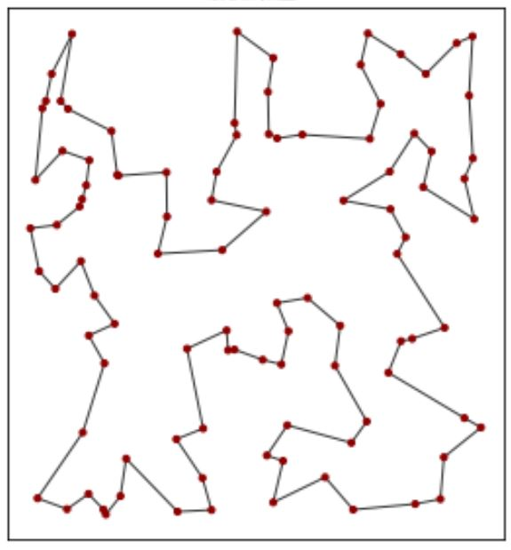
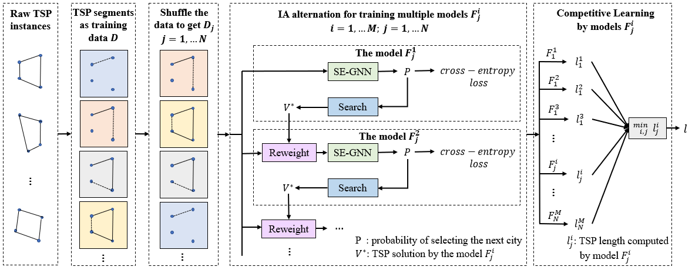

# IA-CL: A Deep Bidirectional Competitive Learning Method for Traveling Salesman Problem

<div align=center>

</div>

The traveling salesman problem (TSP) is a classic NP-hard combinatorial optimization problem. For a given set of city coordinates, the goal of TSP is to find the shortest route that visits each city exactly once and back to the original city. Traditional heuristic algorithms rely on hand-crafted rules to efficiently search for an approximate solution. There is a surge of interests in recent years to develop graph neural network (GNN) based learning methods for the NP-hard traveling salesman problem (TSP). However, the existing methods not only have limited search space but also require a lot of training instances with ground-truth solutions that are time-consuming to compute.

<div align=center>

</div>

We propose a deep bidirectional competitive learning method to address the above issues. The search space is expanded by training multiple weak but complementary models simultaneously, while the sample effiency is significantly improved by devising a gap-aware reweighting scheme over the TSP instances. Specifically, TSP is modeled in a one-by-one construction way by a GNN to assist the heuristic search. Weights are relatively increased for the instances with larger gap between the search algorithm's solution and the optimal one. The reweighted training set are pipelined to train the next TSP model with strength on the error part. 
With the error feedback from the search component, multiple complementary GNNs are obtained using this bidirectional alternations. Finally, we present a simple competing strategy by taking the minimum length of the predictions using the multiple TSP models. Experimental results indicate that our method achieves good generalization.

# Configure the environment

For environment configuration, see "conda_list.txt" and "pip_list.txt". The important ones are the versions of the following libraries.

```
python==3.6.12
pytorch==1.2.0
torchvision==0.4.0
cudatoolkit==10.0.130
torch-scatter==1.3.1
torch-sparse==0.4.0
torch-cluster==1.4.4
torch-spline-conv==1.1.0
torch-geometric==1.3.2
``` 

# Download train Data & test Data
Download the data and unzip it in the current folder.
```
https://pan.baidu.com/s/1tiel2IyNkf9dwRszHiOe2Q 
Password: naf3
```

# Training with IA-CL

## Adjust "config_train.json"

```
gpu_id: select gpu according to the number
arch-graph_size: 20/50/100 for TSP20/TSP50/TSP100 respectively
data_loader-graph_num: 100000/40000/20000 for TSP20/TSP50/TSP100 respectively
```

## Adjust "run_train.sh"

```
num_models: Set according to computing resources
run_id: set arbitrarily
```

## Run "run_train.sh"

```
source ./run_train.sh
```

## Copy models with "cp_models.sh". Note that the path in the file is set according to the actual situation.

```
source ./cp_models.sh
```

# Test with IA-CL

## Adjust "config_test.json"

```
gpu_id: select gpu according to the number
mode: greedy/sampling/beamsearch
arch-graph_size: 20/50/100 for TSP20/TSP50/TSP100 respectively
```

## Adjust "run_test.sh"

```
num_models: Set according to computing resources
run_id: run_id set during training
```

## Run "run_test.sh"

```
source ./run_test.sh
```

## Run "test_cl.py". Pay attention to the args in the file.

```
python test_cl.py
-i: run_id set during training
-n: Number of cities for the test instance 20/50/100
-nm: The number of models used for testing. 
```

# Pretrained models
The trained model is in the following link

```
https://pan.baidu.com/s/1YK9tezjxMmoJR8BScyfVTA 
Password: fj3h
```
